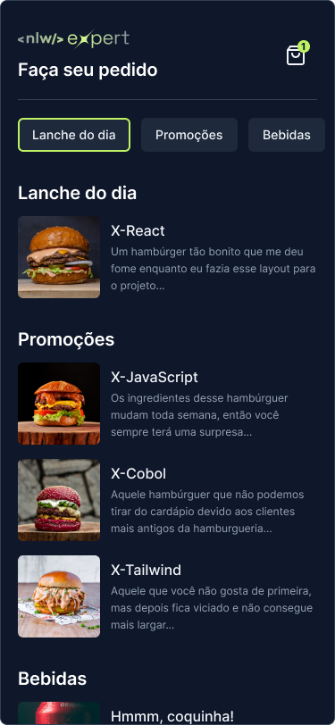
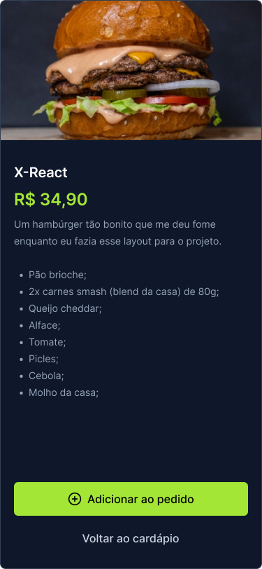

 Status: Completo 🚀

## Food App
O Food App é um aplicativo de cardápio que oferece aos clientes a facilidade de selecionar os pratos desejados. Ao concluir o pedido no aplicativo, a solicitação é automaticamente enviada para o WhatsApp do restaurante, agilizando o processo de compra e proporcionando uma experiência mais conveniente aos usuários.

## Funcionalidades:
 * Seleção de pedidos 
 * Carrinho de compra listando os pedidos desejados
 * Filtro de pratos disponíveis
 * Envio de mensageria ao fechar o pedido

<hr/>
<br/>

<center>
 <div> </div>
<br/>
<div></div>
</center>
<br/>
<hr/>

## Tecnologias Utilizadas:

 * React-Native
 * Nativewind - TailwindCSS
 * Expo
 * clsx
 * typescript
 * zustand
 * async-storage

<br/>
<hr/>

 ## Demonstração:
 
<div>
    
</div>

## Instalação
  * Após a instalação do expo/React-Native em sua máquina
  * Faça um clone do repositório do projeto no GitHub.
  * Navegue até o diretório do projeto.
  * Execute o seguinte comando para instalar as dependências:

```
$ npm install
```

## Running the project
```
$ npx expo start
```


